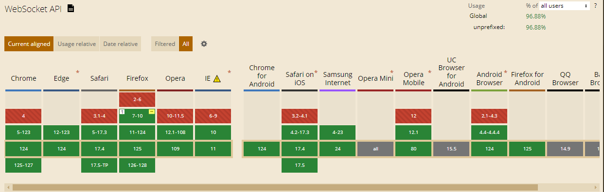

因为情景原因，需要用到WebSocket（应用层协议）
### 什么是websocket,以及它的作用
WebSocket是HTML5规格中的一个非常重要的新特性，它的存在可以允许用户在浏览器中实现双向通信，实现数据的及时推送。
- WebSocket 是 HTML5 开始提供的一种在单个 TCP 连接上进行全双工通讯的协议。
- WebSocket 使得客户端和服务器之间的数据交换变得更加简单，允许服务端主动向客户端推送数据。
- 在 WebSocket API 中，浏览器和服务器只需要完成一次握手，两者之间就直接可以创建持久性的连接，并进行双向数据传输。
- 在 WebSocket API 中，浏览器和服务器只需要做一个握手的动作，然后，浏览器和服务器之间就形成了一条快速通道。两者之间就直接可以数据互相传送。

优点：HTML5 定义的 WebSocket 协议，能更好的节省服务器资源和带宽，并且能够更实时地进行通讯。
浏览器通过 JavaScript 向服务器发出建立 WebSocket 连接的请求，连接建立以后，客户端和服务器端就可以通过 TCP 连接直接交换数据。
当你获取 Web Socket 连接后，你可以通过 **send()** 方法来向服务器**发送数据**，并通过 **onmessage** 事件来**接收**服务器返回的**数据**。

### 简单使用websocket
[HTML5 WebSocket](https://www.runoob.com/html/html5-websocket.html)
```js
 function WebSocketTest(){
    if ("WebSocket" in window){
        alert("您的浏览器支持 WebSocket!");
        // 打开一个 web socket（创建一个websocket对象）
        var ws = new WebSocket("ws://localhost:9998/echo");
        // ws.open 连接建立时触发
        ws.onopen = function(){
            // Web Socket 已连接上，使用 send() 方法发送数据
            ws.send("发送数据"); // 使用连接发送数据
            alert("数据发送中...");
        };

        // 客户端接收服务端数据时触发
        ws.onmessage = function (evt) { 
            var received_msg = evt.data;
            alert("数据已接收...");
        };

        //连接关闭时触发
        ws.onclose = function(){ 
            // 关闭 websocket
            alert("连接已关闭..."); 
        };
    } else {
        // 浏览器不支持 WebSocket
        alert("您的浏览器不支持 WebSocket!");
    }
}
```
#### websocket常用的属性与方法（补充）
<!-- 
##### 1、属性Socket.readyState	（*）
只读属性 readyState 表示连接状态，可以是以下值：
- 0 - 表示连接尚未建立。
- 1 - 表示连接已建立，可以进行通信。
- 2 - 表示连接正在进行关闭。
- 3 - 表示连接已经关闭或者连接不能打开。 -->


### ReconnectingWebSocket是什么
尽管 WebSocket 提供了高效的实时通信能力，但它自身并**不处理网络不稳定导致的连接中断**。这就意味着当 WebSocket 连接因为网络波动或其他原因断开时，需要手动或通过代码逻辑来重新建立连接。这是一项不仅耗时而且容易出错的任务，对于开发者和最终用户来说都不是一个理想的体验。

这时，ReconnectingWebSocket 库就发挥了作用。**ReconnectingWebSocket 是对原生 WebSocket 的一个封装，它在保持原有 WebSocket API 不变的情况下，增加了自动重新连接的功能**。当使用 ReconnectingWebSocket 时，如果连接意外断开，它会自动尝试重新连接，无需开发者手动干预，大大简化了实现逻辑。            

ReconnectingWebSocket 的优势：
1. 自动重连：它会在连接断开时自动尝试重新连接，减轻了开发者处理重连逻辑的负担。
2. 可配置性：你可以自定义重连策略，比如重连尝试的次数、重连的时间间隔等。
3. 简单的API：它提供与原生 WebSocket 相同的 API，让你可以轻松切换而无需大量更改代码。
4. 调试支持：在开发过程中，你可以启用调试模式以监控连接状态和重连行为，帮助快速定位问题。

[WebSocket 超详细 使用ReconnectingWebSocket实现无缝实时通信 原文链接](https://blog.csdn.net/weixin_47192158/article/details/138167070)

两种方法，一种`<script>`标签引入reconnecting-websocket.js 一种是npm安装引入

1、 引入
方法一：使用npm
1. 执行 `npm install reconnecting-websocket`命令安装
2. 在对应使用的页面中引入这个库
```js
import ReconnectingWebSocket from 'reconnecting-websocket';
```

方法二：直接下载reconnecting-websocket.js,在html文件中直接`<script>`标签引入
[reconnecting-websocket.js github地址](https://github.com/joewalnes/reconnecting-websocket/)

2、使用
其实用方法其实保持原有 WebSocket API ，所以优化的时候可以直接将`new WebSocket()`替换成 `new ReconnectingWebSocket()`
后续的API就不多赘述
```js
const url = 'wss://example.com/socket'; // WebSocket 服务端的 URL
// websocket创建实例：
const ws = new WebSocket(url);

// ReconnectingWebSocket 创建实例
const protocols = []; // 可选的子协议数组
const options = {
  // 自动重新连接的选项（可选）
  connectionTimeout: 1000,
  maxRetries: 10,
};
 
const rws = new ReconnectingWebSocket(url, protocols, options);

```
补充：
ReconnectingWebSocket 提供了一些配置选项，允许你自定义重连行为（就是上面例子中options中的属性）：
- debug: 是否启用调试模式，默认为 false。
- automaticOpen: 是否在实例化时自动打开连接，默认为 true。
- reconnectInterval: 重新连接尝试之间的间隔时间（毫秒），默认为 1000。
- maxReconnectInterval: 重新连接尝试之间的最大间隔时间（毫秒），默认为 30000。
- reconnectDecay: 用于增加 reconnectInterval 的乘数，每次尝试重连后会递增，默认为 1.5。
- timeoutInterval: 关闭连接前等待服务器响应的最大时长（毫秒），默认为 2000。
- maxRetries: 最大重连尝试次数，设为 null 代表无限尝试，默认为 null。
- binaryType: 发送和接收二进制数据的类型，可以是 'blob' 或 'arraybuffer'，默认为 'blob'

## 拓展：服务端向客户端推送数据的实现方案有哪几种？
我们常规实现这些需求的方案有以下三种：
1. 轮询
2. websocket
3. SSE

### 轮询简介
在很久很久以前，前端一般使用轮询来进行服务端向客户端进行消息的伪推送，为什么说轮询是伪推送？因为**轮询本质上还是通过客户端向服务端发起一个单项传输的请求，服务端对这个请求做出响应而已**。通过不断的请求来实现服务端向客户端推送数据的错觉。并不是服务端主动向客户端推送数据。显然，轮询一定是上述三个方法里最下策的决定。

轮询的缺点：
1. 首先轮询需要不断的发起请求，每一个请求都需要经过http建立连接的流程（比如三次握手，四次挥手），是没有必要的消耗。
2. 客户端需要从页面被打开的那一刻开始就一直处理请求。虽然每次轮询的消耗不大，但是一直处理请求对于客户端来说一定是不友好的。
3. 浏览器请求并发是有限制的。比如Chrome 最大并发请求数目为 6，这个限制还有一个前提是针对同一域名的，超过这一限制的后续请求将会被阻塞。而轮询意味着会有一个请求长时间的占用并发名额。
4. 而如果轮询时间较长，可能又没有办法非常及时的获取数据


### websocket简介
websocket是一个双向通讯的协议，他的优点是，可以同时支持客户端和服务端彼此相互进行通讯。功能上很强大。

缺点也很明显，websocket是一个新的协议，ws/wss。也就是说，支持http协议的浏览器不一定支持ws协议。

相较于SSE来说，websocket因为功能更强大。结构更复杂。所以相对比较重。

websocket对于各大浏览器的兼容性↓



### SSE简介(Server-Sent Events)
sse是一个单向通讯的协议也是一个长链接，它只能支持服务端主动向客户端推送数据，但是无法让客户端向服务端推送消息。

>长链接是一种HTTP/1.1的持久连接技术，它允许客户端和服务器在一次TCP连接上进行多个HTTP请求和响应，而不必为每个请求/响应建立和断开一个新的连接。长连接有助于减少服务器的负载和提高性能。

SSE的优点是，它是一个轻量级的协议，相对于websockte来说，他的复杂度就没有那么高，相对于客户端的消耗也比较少。而且SSE使用的是http协议（websocket使用的是ws协议），也就是现有的服务端都支持SSE，无需像websocket一样需要服务端提供额外的支持。

**注意:IE大魔王不支持SSE**

SSE对于各大浏览器的兼容性↓


## websocket和SSE有什么区别？

### 轮询
对于当前计算机的发展来说，几乎很少出现同时不支持websocket和sse的情况，所以轮询是在极端情况下浏览器实在是不支持websocket和see的下策。

### Websocket和SSE
我们一般的服务端和客户端的通讯基本上使用这两个方案。首先声明:这两个方案没有绝对的好坏，只有在不同的业务场景下更好的选择。

SSE的官方对于SSE和Websocket的评价是

- WebSocket是全双工通道，可以双向通信，功能更强；SSE是单向通道，只能服务器向浏览器端发送。
- WebSocket是一个新的协议，需要服务器端支持；SSE则是部署在HTTP协议之上的，现有的服务器软件都支持。
- SSE是一个轻量级协议，相对简单；WebSocket是一种较重的协议，相对复杂。
- SSE默认支持断线重连，WebSocket则需要额外部署。
- SSE支持自定义发送的数据类型。

### Websocket和SSE分别适用于什么业务场景？
对于SSE来说，它的优点就是轻，而且对于服务端的支持度要更好。换言之，可以使用SSE完成的功能需求，没有必要使用更重更复杂的websocket。

比如：数据大屏的实时数据，消息中心的消息推送等一系列**只需要服务端单方面推送而不需要客户端同时进行反馈的需求**，SSE就是不二之选。

对于Websocket来说，他的优点就是可以**同时支持客户端和服务端的双向通讯**。所适用的业务场景：最典型的就是聊天功能。这种服务端需要主动向客户端推送信息，并且客户端也有向服务端推送消息的需求时，Websocket就是更好的选择。


了解了三种模式之后，因为这里需要实现的场景是在视频通信的过程中，因为业务员不到场，所以需要客服专员指引用户将摄像头吧对应的车辆部位控制在制定范围，由客服专员点击截图对应的图片（这里主要是客服专员了解需要具体损伤部位以及对应整体的车辆的拍摄的角度，所以由客服人员指引客户），截图数据之后客户信息对应客户在屏幕知道客服具体截图了哪些数据提示，所以使用websocket来解决


